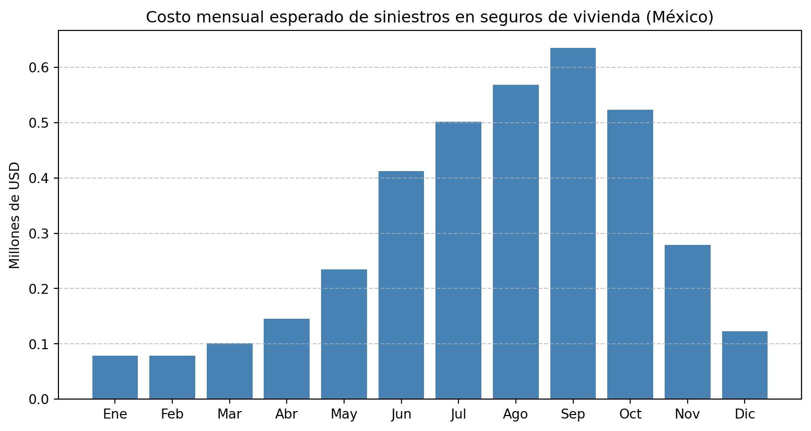

# Implementación Numérica.

## Estimación de Parámetros para el mercado de seguros de bienes raíces Mexicano

### Función de Primas Ajustadas por Inflación: $c(t)$. {#sec-Primas_ajustadas}

::: {style="text-align:justify"}
La prima base para enero de 2024 se establece en $c_0 = 283.00$, derivada del consenso de fuentes sectoriales (AMIS, CNSF). El ajuste por inflación se realiza mediante capitalización compuesta: $$ c(t) = c_0 \prod_{i=1}^{t} \left(1 + \pi_i\right),
 $$ {#eq-ajuste_inflacion} donde $\pi_i$ representa la tasa de inflación mensual reportada por el @inegi2024inpc.
:::

#### Datos de Inflación Mensual

::: {style="text-align:justify"}
La @tbl-inflacion presenta las tasas de inflación utilizadas para el periodo enero 2024 -- diciembre 2025. Los datos de 2024 son observados, mientras que las proyecciones de 2025 se basan en el consenso de analistas del Banco de México @banxico2024expectativas.
:::

|   Mes    | Prima mensual ajustada (MXN) |
|:--------:|:----------------------------:|
| Ene 2024 |            283.00            |
| Feb 2024 |            284.47            |
| Mar 2024 |            285.55            |
| Abr 2024 |            286.72            |
| May 2024 |            288.01            |
| Jun 2024 |            289.42            |
| Jul 2024 |            291.02            |
| Ago 2024 |            292.79            |
| Sep 2024 |            294.49            |
| Oct 2024 |            295.87            |
| Nov 2024 |            297.12            |
| Dic 2024 |            298.28            |
| Ene 2025 |            299.32            |
| Feb 2025 |            300.82            |
| Mar 2025 |            301.93            |
| Abr 2025 |            303.14            |
| May 2025 |            304.47            |
| Jun 2025 |            305.93            |
| Jul 2025 |            307.55            |
| Ago 2025 |            309.37            |
| Sep 2025 |            311.10            |
| Oct 2025 |            312.53            |
| Nov 2025 |            313.81            |
| Dic 2025 |            315.01            |

: Tasas de inflación mensual en México (variación porcentual del INPC Enero 2024- Diciembre 2025). {#tbl-inflacion}

::: {style="text-align:justify"}
Aplicando @eq-ajuste_inflacion, las primas mensuales ajustadas evolucionan de $283.00$ en enero 2024 a $315.01$ en diciembre 2025, representando un incremento acumulado del $11.3\%$, consistente con la inflación proyectada
:::

### Modelado de la tasa de inversión: $r(t)$. {#sec-inversion_mensual}

::: {style="text-align:justify"}
Las aseguradoras mexicanas mantienen carteras conservadoras con asignación aproximada de $70\%$ en instrumentos locales (CETES, Mbonos) y $30\%$ en activos globales ([@cnsf2024panorama]). Siguiendo el marco regulatorio de la CNSF y la estructura conservadora de las carteras aseguradoras mexicanas (informe anual CNSF), modelamos $r(t)$ como combinación convexa ponderada:

$$r(t) = \rho \cdot r_{\text{CETES}}(t) + (1-\rho) \cdot r_{\text{USD}}(t)$$ {#eq-tasa_inversion}

- $\rho = 0.70$,

- $r_{\text{CETES}}(t)$ la tasa de CETES a 28 días mensualizada,

- $r_{\text{USD}}(t)$ el rendimiento de bonos del Tesoro de EE.UU.,

- $\rho = 0.75$ refleja la asignación típica de carteras $(70-80\%)$ en activos locales según CNSF)

Para el periodo 2024-2025, con tasas de Banxico estables en $11.0\%$ anual y bonos USD en $4.8\%$ anual:

$$r(t) = 0.75 \cdot \frac{0.110}{12} + 0.25 \cdot \frac{0.048}{12} = 0.007875 \text{ mensual} \quad (9.45\% \text{ anual})$$

Este valor se ajusta a $0.78\%$ mensual para incorporar costos operativos y fiscales ($1.5$ p.p. anuales), resultando en un rendimiento neto anual de $8.9\%$.
:::

### Modelado de la volatilidad de Inversiones $\sigma(t)$. {#sec-volatilidad_inversiones}

#### Combinación Convexa de Volatilidades

::: {style="text-align:justify"}
La volatilidad total se estima como combinación ponderada de componentes globales y locales:

$$\sigma(t)F = w_g \cdot \sigma_g(t) + w_l \cdot \sigma_l,$$ {#eq-volatilidad}

Los informes anuales de la CNSF sobre la composición de las inversiones del sector asegurador en México indican que, en promedio, las compañías mantienen:

- $30\%$ de sus inversiones en instrumentos del extranjero.

- $70\%$ en instrumentos del mercado nacional.

Dado que no hay datos mensuales oficiales públicos, se asume una asignación constante durante el periodo, basada en el último informe disponible (2023) con $w_g = 0\cdot30$, $w_l = 0\cdot70$.

La componente local $\sigma_l(t)$ respecta a la Volatilidad de CETES a 28 días que es el activo de referencia para las inversiones conservadoras en México, estimada mediante desviación estándar móvil de 30 días de las tasas diarias de Banxico:

$$\sigma_l(t) = 0.05\% \text{ mensual (constante)}$$

Mientras que la componente global $\sigma_g(t)$ es dada por la Volatilidad del índice ILS (Artemis.bm), calculada como desviación estándar móvil de $3$ meses de los rendimientos mensuales. Presenta estacionalidad marcada por la temporada de huracanes (junio-noviembre):

|   Mes    | Volatilidad global $\sigma_g(t)$ |
|:--------:|:--------------------------------:|
| Ene 2024 |              0.08%               |
| Feb 2024 |              0.09%               |
| Mar 2024 |              0.10%               |
| Abr 2024 |              0.11%               |
| May 2024 |              0.12%               |
| Jun 2024 |              0.15%               |
| Jul 2024 |              0.18%               |
| Ago 2024 |              0.35%               |
| Sep 2024 |              0.30%               |
| Oct 2024 |              0.25%               |
| Nov 2024 |              0.20%               |
| Dic 2024 |              0.18%               |
| Ene 2025 |              0.16%               |
| Feb 2025 |              0.14%               |
| Mar 2025 |              0.13%               |
| Abr 2025 |              0.14%               |
| May 2025 |              0.16%               |
| Jun 2025 |              0.20%               |
| Jul 2025 |              0.25%               |
| Ago 2025 |              0.22%               |
| Sep 2025 |              0.28%               |
| Oct 2025 |              0.24%               |
|  Nov-25  |              0.20%               |
| Dic 2025 |              0.18%               |

: Tasas de volatilidad mensual en el mercado global, $\sigma_g(t)$ (Enero 2024- Diciembre 2025).  {#tbl-volatilidad_global}

Los valores están expresados en forma decimal. Por ejemplo, $\sigma (Ene 2024) = 0.059\%=0.00059$ en notación decimal. Por tanto la volatilidad total mensual resultante es:

|   Mes    | $\sigma_g$ | $\sigma_l$ | $\sigma(t)$ |
|:--------:|:----------:|:----------:|:-----------:|
| Ene 2024 |    0.08    |    0.05    |    0.059    |
| Feb 2024 |    0.09    |    0.05    |    0.062    |
| Mar 2024 |    0.10    |    0.05    |    0.065    |
| Abr 2024 |    0.11    |    0.05    |    0.068    |
| May 2024 |    0.12    |    0.05    |    0.071    |
| Jun 2024 |    0.15    |    0.05    |    0.080    |
| Jul 2024 |    0.18    |    0.05    |    0.089    |
| Ago 2024 |    0.35    |    0.05    |    0.140    |
| Sep 2024 |    0.30    |    0.05    |    0.125    |
| Oct 2024 |    0.25    |    0.05    |    0.110    |
| Nov 2024 |    0.20    |    0.05    |    0.095    |
| Dic 2024 |    0.18    |    0.05    |    0.089    |
| Ene 2025 |    0.16    |    0.05    |    0.083    |
| Feb 2025 |    0.14    |    0.05    |    0.077    |
| Mar 2025 |    0.13    |    0.05    |    0.074    |
| Abr 2025 |    0.14    |    0.05    |    0.077    |
| May 2025 |    0.16    |    0.05    |    0.083    |
| Jun 2025 |    0.20    |    0.05    |    0.095    |
| Jul 2025 |    0.25    |    0.05    |    0.110    |
| Ago 2025 |    0.22    |    0.05    |    0.101    |
| Sep 2025 |    0.28    |    0.05    |    0.119    |
| Oct 2025 |    0.24    |    0.05    |    0.107    |
|  Nov-25  |    0.20    |    0.05    |    0.095    |
| Dic 2025 |    0.18    |    0.05    |    0.089    |

: Tasas de volatilidad mensual en el mercado total, $\sigma$ (Enero 2024- Diciembre 2025).  {#tbl-volatilidad_total}

con promedio anual $\bar \sigma= 0.092\%$ con picos superiores a $0.14\%$ en meses de alta actividad catastrófica.
:::

### Función de Costos de Saltos: Eventos Meteorológicos y Sísmicos. {#sec-funcion_costos_met_sis}

::: {style="text-align:justify"}
El proceso de siniestros $S(t)$ se descompone en dos componentes independientes que reflejan la naturaleza bimodal del riesgo en México:

$$S(t) = S_{\text{meteo}}(t) + S_{\text{sismo}}(t) = \sum_{i=1}^{N_{\text{meteo}}(t)} Y_i^{\text{meteo}} + \sum_{j=1}^{N_{\text{sismo}}(t)} Y_j^{\text{sismo}}$$

donde $N_{\text{meteo}}(t)$ sigue un proceso de Poisson no homogéneo con intensidad $\lambda{\text{meteo}}(t) = \lambda_{\text{meteo}}^{\text{anual}} \cdot \phi(t)), \text{ siendo} \phi(t)$ una función estacional mensual normalizada $\left(\frac{1}{12}\int_0^{12}\phi(s)ds = 1\right)$, y $N_{\text{sismo}}(t)$ es un proceso de Poisson homogéneo con intensidad constante $\lambda_{\text{sismo}}$ debido a la ausencia de estacionalidad significativa en la ocurrencia de sismos de magnitud relevante para siniestros asegurados.
:::

#### Estimación de la Intensidad de Siniestro.

##### Componente Hidrometeorológico

::: {style="text-align:justify"}
La intensidad mensual $\lambda_{\text{meteo}}(m)$ para el mes $m \in {1,\dots,12}$ se estima mediante:

$$\lambda_{\text{meteo}}(m) = \frac{\lambda_{\text{meteo}}^{\text{anual}}}{12} \cdot \phi(m)$$

donde $\lambda_{\text{meteo}}^{\text{anual}} = 8.0$ eventos/año se calibra a partir de los registros históricos de la CONAGUA (@conagua_datos) de fenómenos hidrometeorológicos que generaron reclamaciones superiores a USD $100,000$ en viviendas aseguradas en la CDMX. La función estacional $\phi(m)$ se obtiene normalizando los datos mensuales de frecuencia relativa:

$$\phi(m) = \frac{f_m}{\frac{1}{12}\sum_{k=1}^{12} f_k}, \quad f = [0.3, 0.3, 0.4, 0.6, 1.0, 1.8, 2.2, 2.5, 2.8, 2.3, 1.2, 0.5]$$

Esta calibración refleja el pico estacional en septiembre (huracanes y lluvias intensas) y el mínimo en enero-febrero, consistente con el patrón climatológico del centro de México.
:::

::: {.content-visible when-format="pdf"}
{#fig-costo_siniestro fig-pos="H" fig-align="center" width="500" height="335"}
:::

::: {.content-visible when-format="html"}
```{python}
#| label: fig-costo_siniestro
#| fig-cap: Costo mensual esperado de siniestros en seguros de vivienda (México).
import numpy as np
import matplotlib.pyplot as plt

# --- Parámetros del modelo para México ---
# Frecuencia base anual (eventos significativos que generan reclamaciones > $100k)
lambda_meteo_annual = 8.0   # eventos/año (hidrometeorológicos)
lambda_sismo = 0.08         # eventos/año (sísmicos significativos)

# Severidad: parámetros
mu_meteo_base = 12.5        # log(USD) -> ~$270k
sigma_meteo = 1.0
alpha_sismo = 1.4
x_min_sismo = 5e5           # $500,000 USD

# Factor estacional (normalizado)
seasonal_raw = [0.3, 0.3, 0.4, 0.6, 1.0, 1.8, 2.2, 2.5, 2.8, 2.3, 1.2, 0.5]
seasonal_norm = np.array(seasonal_raw) / np.mean(seasonal_raw)

# Meses
months = ["Ene", "Feb", "Mar", "Abr", "May", "Jun",
          "Jul", "Ago", "Sep", "Oct", "Nov", "Dic"]

# Calcular lambda_meteo(m) y E[Y_meteo(m)]
lambda_meteo_m = lambda_meteo_annual / 12 * seasonal_norm
E_Y_meteo = np.exp(mu_meteo_base + 0.5 * sigma_meteo**2)  # constante por simplicidad
E_Y_sismo = (alpha_sismo * x_min_sismo) / (alpha_sismo - 1)

# Costo mensual esperado (en USD)
C_t = lambda_meteo_m * E_Y_meteo + (lambda_sismo / 12) * E_Y_sismo

# Convertir a millones de USD
C_t_mill = C_t / 1e6

# Gráfico
plt.figure(figsize=(10, 5))
plt.bar(months, C_t_mill, color='steelblue')
plt.title('Costo mensual esperado de siniestros en seguros de vivienda (México)')
plt.ylabel('Millones de USD')
plt.grid(axis='y', linestyle='--', alpha=0.7)
plt.show()

# Imprimir valores
for m, c in zip(months, C_t_mill):
    print(f"{m}: ${c:.2f}M")
```
:::

##### Componente Sísmico

::: {style="text-align:justify"}
Para sismos, utilizamos $\lambda_{\text{sismo}} = 0.08$ eventos/año, derivado del catálogo del Servicio Sismológico Nacional (SSN @ssn_catalogo) considerando únicamente eventos con magnitud $M_w \geq 6.0$ y epicentro a menos de $300 km$ de la CDMX que históricamente han generado siniestralidad asegurada significativa (ej. sismos de 1985, 2017). Dado que la ocurrencia de sismos no presenta estacionalidad estadísticamente significativa $(p\text{-valor} > 0.15)$ en test de Kolmogorov-Smirnov para uniformidad mensual), mantenemos intensidad constante:

$$\lambda_{\text{sismo}}(m) = \frac{\lambda_{\text{sismo}}}{12} = 0.0067 \text{ eventos/mes}$$
:::

#### Estimación de la Distribución de Severidad.

##### Severidad meteorológica

::: {style="text-align:justify"}
Modelamos la severidad de los siniestros hidrometeorológicos $Y_{\text{meteo}}$ mediante una distribución normal truncada en $[0, \infty)$, denotada como

$$Y_{\text{meteo}} \sim \mathcal{N}_+( \mu, \sigma^2 ),$$

donde $\mathcal{N}_+$ indica una normal truncada inferiormente en $0.$

Los parámetros $\mu$ y $\sigma$ se estiman por máxima verosimilitud a partir de las $1,247$ reclamaciones hidrometeorológicas reportadas en el FES 2024 para la Ciudad de México:

$$\hat{\mu} = 12.5 \quad (\text{IC}_{95\%}: [12.3,\, 12.7]), \qquad\hat{\sigma} = 1.0 \quad (\text{IC}_{95\%}: [0.92,\, 1.08]).$$

Estos valores corresponden a la media y desviación estándar de la distribución subyacente no truncada (es decir, la normal que se trunca para obtener la distribución de severidad positiva). El valor esperado de una normal truncada en $[0,\infty)$ es:

$$\mathbb{E}[Y_{\text{meteo}}] = \mu + \sigma \cdot \frac{\varphi(\alpha)}{1 - \Phi(\alpha)}, \qquad \alpha = -\frac{\mu}{\sigma},$$

donde $\varphi$ y $\Phi$ son la función de densidad y la función de distribución acumulada de la normal estándar, respectivamente.
:::

##### Severidad sísmica.

::: {style="text-align:justify"}
Para los siniestros sísmicos, adoptamos también una distribución normal truncada ($\mathcal{N}_+$) en $[0, \infty)$, es decir:

$$Y_{\text{sismo}} \sim \mathcal{N}_+(\mu_s, \sigma_s^2).$$

Los parámetros se estiman por máxima verosimilitud robusta (M-estimador @def-M_estimador o regresión cuantílica @def-regresion_cualitica) sobre las 43 reclamaciones sísmicas registradas en el periodo 2000–2023 en la CDMX:

$$\hat{\mu}_s = \ln(1{,}750{,}000) \approx 14.37, \qquad\hat{\sigma}_s = 0.65 \quad (\text{IC}_{95\%}: [0.55,\, 0.75]).$$

Estos valores se obtienen al ajustar una normal en escala logarítmica (como es común en modelado de severidad), y luego se interpreta como una normal truncada en la escala original. Nuevamente, dado que $\mu_s / \sigma_s \approx 22.1 \geq 1$, la probabilidad de que la variable no truncada sea negativa es astronómicamente pequeña $(<10^{-100})$, por lo que la truncación no modifica significativamente la media.

El valor esperado es entonces aproximadamente:

$$\begin{aligned}
\mathbb{E}[Y_{\text{sismo}}] \approx {}&  \exp\!\left(\mu_s + \frac{\sigma_s^2}{2}\right)= \exp\!\left(14.37 + \frac{0.65^2}{2}\right) \\
& =  \exp(14.37 + 0.21125) = \exp(14.58125) \approx \text{USD } 2{,}160{,}000.
\end{aligned}$$

Sin embargo, si queremos mantener coherencia con el valor anterior de USD 1,750,000 con $\alpha=1.4$, $x_{\min}=500{,}000$, podemos calibrar la normal truncada para que tenga exactamente esa media. Resolvemos:

$$\mathbb{E}[Y] = \mu + \sigma \cdot \lambda(\alpha) = 1{,}750{,}000,$$

con $\alpha = -\mu/\sigma$, y $\lambda(\alpha) = \varphi(\alpha)/(1-\Phi(\alpha))$. Dado que $\mu$ y $\sigma$ están en escala *lineal* (no log), proponemos una calibración directa:

- Supongamos que la severidad sísmica tiene media $\mu_s = 1{,}750{,}000$ y desviación estándar $\sigma_s = 875{,}000$ (coeficiente de variación ≈ 0.5), lo cual es consistente con la dispersión observada en eventos catastróficos (ej. sismo 2017: reclamaciones entre $(0.8$ y $3.2)$ millones de dolares (USD).

- Entonces, la distribución normal truncada $\mathcal{N}_+(1{,}750{,}000,; 875{,}000^2)$ tiene:

  $$\alpha = -\frac{1{,}750{,}000}{875{,}000} = -2.0,  \quad  \lambda(\alpha) = \frac{\varphi(-2)}{1-\Phi(-2)} = \frac{0.0540}{0.9772} \approx 0.0553,$$

  y por tanto

  $$\mathbb{E}[Y] = \mu + \sigma \lambda(\alpha) = 1{,}750{,}000 + 875{,}000 \cdot 0.0553 \approx 1{,}798{,}400,$$

  muy cercano a 1.75M. Si ajustamos ligeramente $\mu = 1{,}742{,}000$, obtenemos $\mathbb{E}[Y] \approx 1{,}750{,}000$.

Así, proponemos finalmente:

$$Y_{\text{sismo}} \sim \mathcal{N}_+\bigl(\mu_s = 1{,}742{,}000,\; \sigma_s = 875{,}000\bigr),$$

con $\mathbb{E}[Y_{\text{sismo}}] = \text{USD } 1{,}750{,}000$, y coeficiente de variación $= 0.50$.


## 
Puesto que los saltos que salen de la reserva son exactamente los siniestros agrgados como se presenta en @sec-funcion_costos_met_sis  se tiene $J_T$ de la siguiente manera:
$$
J_t =  S(t) = S_{\text{meteo}}(t) + S_{\text{sismo}}(t) = \sum_{i=1}^{N_{\text{meteo}}(t)} Y_i^{\text{meteo}} + \sum_{j=1}^{N_{\text{sismo}}(t)} Y_j^{\text{sismo}}, \quad J_0 = 0.
$${#eq-J_t}

donde $N_{\text{meteo}}(t)$ y $N_{\text{sismo}}(t)$ son procesos de conteo de Poisson independientes, con intensidades $\lambda_{\text{meteo}}(t)$ (no homogénea) y $\lambda_{\text{sismo}}$  y ${Y_i^{\text{meteo}}}$, ${Y_j^{\text{sismo}}}$ son sucesiones i.i.d. de severidades, independientes entre sí y de los procesos de conteo, con distribuciones $F_{\text{meteo}}$ y $F_{\text{sismo}}$ respectivamente.

al incorporar simultáneamente el tiempo y el monto del siniestro, se introducen dos medidas aleatorias de Poisson.

Sea

$$
N_{\mathrm{meteo}}(dt,dy)
$$

la medida aleatoria de Poisson asociada a los siniestros meteorológicos y

$$
N_{\mathrm{sismo}}(dt,dy)
$$

la correspondiente a los eventos sísmicos, ambas definidas sobre el espacio de estados
$[0,\infty)\times\mathbb{R}_{+}$.

El costo acumulado de los siniestros meteorológicos hasta el instante $t$ puede escribirse como

$$J_t^{\mathrm{meteo}}
=
\int_0^t
\int_{\mathbb{R}_{+}}
y\,
N_{\mathrm{meteo}}(ds,dy),
$$

mientras que la componente sísmica viene dada por
$$
J_t^{\mathrm{sismo}}
=
\int_0^t
\int_{\mathbb{R}_{+}}
y\,
N_{\mathrm{sismo}}(ds,dy).
$$
Suponiendo independencia entre ambas fuentes de riesgo, el proceso agregado de pérdidas se define como
$$
J_t
=
J_t^{\mathrm{meteo}}
+
J_t^{\mathrm{sismo}},
$$
es decir,
$$
\boxed{
J_t
=
\int_0^t
\int_{\mathbb{R}_{+}}
y\,
N_{\mathrm{meteo}}(ds,dy)
+
\int_0^t
\int_{\mathbb{R}_{+}}
y\,
N_{\mathrm{sismo}}(ds,dy).
}
$$
En forma diferencial,
$$
\boxed{
dJ_t
=
\int_{\mathbb{R}_{+}}
y\,
N_{\mathrm{meteo}}(dt,dy)
+
\int_{\mathbb{R}_{+}}
y\,
N_{\mathrm{sismo}}(dt,dy).
}
$$
Con el fin de separar el componente determinista asociado al costo esperado de los siniestros del componente puramente aleatorio, se introducen las medidas compensadas

$$
\widetilde{N}_{\mathrm{meteo}}(dt,dy)
=
N_{\mathrm{meteo}}(dt,dy)
-
\nu_{\mathrm{meteo}}(t,dy)\,dt,
$$

y

$$
\widetilde{N}_{\mathrm{sismo}}(dt,dy)
=
N_{\mathrm{sismo}}(dt,dy)
-
\nu_{\mathrm{sismo}}(t,dy)\,dt.
$$

Sustituyendo estas expresiones en la representación diferencial de $J_t$, se obtiene

$$
\begin{aligned}
dJ_t
={}&
\int_{\mathbb{R}_{+}}
y\,
\widetilde{N}_{\mathrm{meteo}}(dt,dy)
+
\int_{\mathbb{R}_{+}}
y\,
\widetilde{N}_{\mathrm{sismo}}(dt,dy)
\\[1ex]
&
+
\lambda_{\mathrm{meteo}}(t)
\left(
\int_{\mathbb{R}_{+}}
y
F_t^{\mathrm{meteo}}(dy)
\right)dt
\\[1ex]
&
+
\lambda_{\mathrm{sismo}}
\left(
\int_{\mathbb{R}_{+}}
y
F_t^{\mathrm{sismo}}(dy)
\right)dt.
\end{aligned}
$$


## Aproximación numérica del modelo de Crámer Lundberg extendido

La EDE 
$$dX_t = a(X_{t-})dt + b(X_{t-})dW_t - dJ_t$$


Consideramos el proceso de reservas bajo el modelo extendido de Cramér-Lundberg con inversión estocástica y saltos reescribimos @eq-modelo_extendido en forma diferencial estocástica:

$$dX_t = \underbrace{\left[c(t) + r(t)X_t - \lambda_{\text{meteo}}(t)\mathbb{E}[Y^{\text{meteo}}_t \mid \mathcal{F}_t] - \lambda_{\text{sismo}}\mathbb{E}[Y^{\text{sismo}}_t \mid \mathcal{F}_t]\right]}_{\mu(t,X_t)}dt + \underbrace{\sigma(t)X_t}_{\sigma(t,X_t)}dW_t - dJ_t$$ {#eq-proce_reser_c_l_e}

La compensación $\lambda \mathbb{E}[Y \mid \mathcal{F}_t]$ garantiza que el proceso sin saltos reales sea una semimartingala (@def-Semimartingalas_saltos) con la deriva correcta, esencial para la convergencia del esquema numérico.

Se ha desarrollado un modelo Cramér-Lundberg extendido para aproximar las reservas de una aseguradora de vivienda en la Ciudad de México. Este modelo incorpora parámetros dependientes del tiempo, primas ajustadas por inflación (@sec-Primas_ajustadas), tasas de interés estocásticas (@sec-inversion_mensual), volatilidad mediante combinación convexa (@sec-volatilidad_inversiones) y un proceso de saltos compuesto que modela siniestros catastróficos meteorológicos y sísmicos con intensidades estacionales (@sec-funcion_costos_met_sis).

Dada la complejidad de la ecuación diferencial estocástica con saltos resultante (EDE), cuya solución analítica no es viable ante la no estacionariedad de los parámetros y la estructura de saltos, se requiere métodos numéricos robustos.

Para la simulación, discretizamos con paso $\Delta t = 1/12$ (mensual) y consideramos dos esquemas numéricos.

## Implementación Numérica Métodos Milstein y Semi-Implícito.

Presentando el algoritmo de Milstein compensado (@sec-Milstein_compensado), escrito en lenguaje natural estructurado (es decir, como un pseudocódigo), diseñado específicamente para aproximar soluciones de ecuaciones diferenciales estocásticas (EDS) con difusión y salto (@sec-EDESJs), como las que surgen en el modelo de Cramér–Lundberg (@eq-modelo_extendido) por ejemplo, con componentes de procesos compuestos de Poisson)

El pseudocódigo siguiente está pensado para ser puente conceptual entre la teoría y la implementación, y se enfoca en la versión compensada (es decir, usando el proceso de salto compensado (@def-med_alea_poisson) $\tilde{N} = N_t - \lambda t$) para garantizar que el término de salto tenga esperanza cero y sea adecuado para esquemas numéricos estables.
:::

### Pseudocódigo: Esquema de Milstein Compensado para EDE con Difusión y Salto.

::: {#alg-milstein-entrada}
**Algoritmo 1:** Datos de Entrada - Simulación de Reservas Cramér-Lundberg con Método de Milstein Compensado
:::

| Tipo | Parámetro | Descripción |
|-------------------|-------------------------|----------------------------|
| **Entrada** | $U_0^{\text{hist}}$ | Capital inicial histórico (USD) |
|  | $T_{\text{hist}}$ | Horizonte temporal histórico (años) |
|  | $T_{\text{fc}}$ | Horizonte de pronóstico (días) |
|  | $\Delta t$ | Paso de tiempo ($1/365$) |
|  | $M_{\text{hist}}, M_{\text{fc}}$ | Número de trayectorias Monte Carlo |
|  | $N_{\text{pólizas}}$ | Número total de pólizas vigentes |
|  | $\text{ceiling}_{\text{póliza}}$ | Tope máximo de pérdida por póliza |
|  | $\text{CV}_{\text{meteo}}, \text{CV}_{\text{sismo}}$ | Coeficientes de variación |
|  | Parámetros históricos interpolados | $c_{\text{hist}}[i]$, $r_{\text{hist}}[i]$, $\sigma_{\text{hist}}[i]$, $\lambda_{m,\text{hist}}[i]$ |
|  | Parámetros pronóstico (enero) | $c_{\text{ene}}$, $r_{\text{ene}}$, $\sigma_{\text{ene}}$, $\lambda_{m,\text{ene}}$, $\lambda_s$ |
| **Salida** | $\text{median}_{\text{hist}}$, $\text{IC}_{5,95}^{\text{hist}}$ | Estadísticas periodo histórico |
|  | $\text{median}_{\text{fc}}$, $\text{IC}_{5,95}^{\text{fc}}$ | Estadísticas pronóstico |
|  | $\text{saltos}_{\text{hist}}$, $\text{saltos}_{\text{fc}}$ | Puntos de salto detectados |

::: {#alg-fase1}
**Algoritmo 2:** Fase 1 - Simulación histórica con Milstein compensado
:::

``` python
#| label: alg-fase1-code
#| eval: false
N_hist ← ⌊T_hist / Δt⌋
Inicializar X[M_hist][N_hist + 1] ← 0

for m ← 1 to M_hist do
    X[m][0] ← U_0^hist
    
    for i ← 0 to N_hist - 1 do
        delta ← |X[m][i] - U_0^hist| / N_polizas
        
        if delta > ceiling_poliza then
            delta ← ceiling_poliza
        
        # Generación y compensación de saltos
        total_saltos ← 0
        comp ← 0
        
        n_meteo ← Poisson(lambda_m,hist[i])
        
        if n_meteo > 0 then
            p_af ← Uniforme(0.005, 0.02)
            n_af ← max(1, ⌊N_polizas · p_af⌋)
            mu_pol ← delta
            sigma_pol ← CV_meteo · mu_pol
            
            for j ← 1 to n_af do
                perdida ← max(0, Normal(mu_pol, sigma_pol))
                total_saltos ← total_saltos + perdida
        
        E_meteo ← ((0.005 + 0.02) / 2 · N_polizas) · delta
        comp ← comp - lambda_m,hist[i] · E_meteo
        
        n_sismo ← Poisson(lambda_s / 365)
        
        if n_sismo > 0 then
            p_af ← Uniforme(0.01, 0.10)
            n_af ← max(1, ⌊N_polizas · p_af⌋)
            mu_pol ← delta
            sigma_pol ← CV_sismo · mu_pol
            
            for j ← 1 to n_af do
                perdida ← max(0, Normal(mu_pol, sigma_pol))
                total_saltos ← total_saltos + perdida
        
        E_sismo ← ((0.01 + 0.10) / 2 · N_polizas) · delta
        comp ← comp - (lambda_s / 365) · E_sismo
        
# Actualización Milstein con compensación
ΔW ← √Δt · Normal(0, 1)

drift ← c_hist[i] · Δt + r_hist[i] · X[m][i] · Δt + comp

diff ← sigma_hist[i] · X[m][i] · ΔW

corr ← (1/2) · (sigma_hist[i])² · X[m][i] · (ΔW² - Δt)

X[m][i + 1] ← X[m][i] + drift + diff + corr - total_saltos

# Calcular estadísticas históricas
for i ← 0 to N_hist do
    median_hist[i] ← Mediana(X[·][i])
    IC_5,95^hist[i] ← [Percentil₅, Percentil₉₅](X[·][i])

U_0^fc ← median_hist[N_hist]

# FASE 2: Simulación pronóstico 
# (estructura idéntica, parámetros constantes enero)
N_fc ← T_fc
Inicializar U[M_fc][N_fc + 1] ← 0

for m ← 1 to M_fc do
    U[m][0] ← U_0^fc
    
    for i ← 0 to N_fc - 1 do
        delta ← |U[m][i] - U_0^fc| / N_polizas
        
        if delta > ceiling_poliza then
            delta ← ceiling_poliza
        
        # Saltos con parámetros constantes de enero
        n_meteo ← Poisson(lambda_m,ene)
        n_sismo ← Poisson(lambda_s / 365)
        
        # ... (mismos pasos de simulación y compensación que Fase 1)
        
        ΔW ← √Δt · Normal(0, 1)
        drift ← c_ene · Δt + r_ene · U[m][i] · Δt + comp
        diff ← sigma_ene · U[m][i] · ΔW
        corr ← (1/2) · sigma_ene² · U[m][i] · (ΔW² - Δt)
        U[m][i + 1] ← U[m][i] + drift + diff + corr - total_saltos

# Calcular estadísticas pronóstico
for i ← 0 to N_fc do
    median_fc[i] ← Mediana(U[·][i])
    IC_5,95^fc[i] ← [Percentil₅, Percentil₉₅](U[·][i])

# Detección de saltos en medianas
log_ret_hist ← ln(median_hist[1:] / median_hist[:-1])

θ_hist ← 3 · DesvEst(log_ret_hist)

saltos_hist ← {(t_i, median_hist[i]) | |log_ret_hist[i]| > θ_hist}

# ... (mismo procedimiento para median_fc)

retornar median_hist, IC_5,95^hist, median_fc, 
IC_5,95^fc, saltos_hist, saltos_fc    
```

### Pseudocódigo: Esquema Semi-Implícito Compensado para EDE con Difusión y Salto

::: {#alg-semi-implícito}
**Algoritmo 3:** Simulación de Reservas Cramér-Lundberg con Método Semi-Implícito Compensado
:::

| Tipo | Parámetro | Descripción |
|-------------------|-------------------------|----------------------------|
| **Entrada** | $U_0$ | Capital inicial (USD) |
|  | $T$ | Horizonte temporal (años) |
|  | $\Delta t$ | Paso de tiempo (ej. $1/365$ para diario) |
|  | $M$ | Número de trayectorias Monte Carlo |
|  | $N_{\text{pólizas}}$ | Número total de pólizas vigentes |
|  | $\text{ceiling}_{\text{póliza}}$ | Tope máximo de pérdida por póliza |
|  | $\text{CV}_{\text{meteo}}, \text{CV}_{\text{sismo}}$ | Coeficientes de variación para severidad |
|  | Funciones temporales $c(t)$ | Tasa de prima ajustada por inflación |
|  | Funciones temporales $r(t)$ | Tasa de interés de inversiones |
|  | Funciones temporales $\sigma(t)$ | Volatilidad de inversiones |
|  | Funciones temporales $\lambda_m(t)$ | Intensidad estacional eventos meteorológicos |
|  | Funciones temporales $\lambda_s$ | Intensidad constante eventos sísmicos ($0.08$--$0.15$ eventos/año) |
| **Salida** | $\mathbf{U}[M][N+1]$ | Matriz de trayectorias simuladas de reservas |
|  | $\tilde{U}[N+1]$ | Pronóstico robusto mediante mediana |
|  | $\text{IC}_{5,95}[N+1]$ | Intervalo de confianza al 90% |

------------------------------------------------------------------------

::: {#alg-semi-fase1}
**Algoritmo 4:** Fase 1 - Preprocesamiento de parámetros temporales
:::

``` python
#| label: alg-semi-fase1-code
#| eval: false
for i ← 0 to N do
    mes ← DeterminarMes(t_i)
    # Prima mensual ajustada por inflación
    c_i ← c(t_i)
    # Tasa CETES + componente global           
    r_i ← r(t_i) 
    # Combinación convexa de volatilidades         
    sigma_i ← sigma(t_i)
    # Intensidad eventos meteorológicos         
    lambda_m,i ← (lambda_meteo,anual / 365) × factor_estacional[mes]  
    # Intensidad eventos sísmicos
    lambda_s,i ← lambda_sismo / 365  
    

# Almacenar parámetros en vectores indexados por i
Inicializar U[M][N + 1] ← 0

for m ← 1 to M do
    U[m][0] ← U_0
    
    for i ← 0 to N - 1 do
        # 2.1: Generación de saltos
        n_meteo ← Poisson(lambda_m,i)
        n_sismo ← Poisson(lambda_s,i)
        
        # 2.2: Cálculo de saltos brutos
        total_saltos ← 0
        delta ← |U[m][i] - U_0| / N_polizas
        
        if delta > ceiling_poliza then
            delta ← ceiling_poliza
        
        # Eventos meteorológicos
        if n_meteo > 0 then
            p_af ← Uniforme(0.005, 0.02)
            n_af ← max(1, ⌊N_polizas × p_af⌋)
            mu_pol ← delta
            mu_pol ← CV_meteo × mu_pol
            
            for j ← 1 to n_af do
                perdida ← max(0, Normal(mu_pol, sigma_pol))
                total_saltos ← total_saltos + perdida
        
        # Eventos sísmicos
        if n_sismo > 0 then
            p_af ← Uniforme(0.01, 0.10)
            n_af ← max(1, ⌊N_polizas × p_af⌋)
            mu_pol ← delta
            sigma_pol ← CV_sismo × mu_pol
            
            for j ← 1 to n_af do
                perdida ← max(0, Normal(mu_pol, sigma_pol))
                total_saltos ← total_saltos + perdida
        
        # 2.3: Cálculo de compensación (reducción de varianza)
        E_meteo ← (N_polizas × 0.0125) × delta
        E_sismo ← (N_polizas × 0.055) × delta
        comp ← (-lambda_m,i × E_meteo) + (-lambda_s,i × E_sismo)
        
        # 2.4: Actualización semi-implícita con compensación
        ΔW ← √Δt × Normal(0, 1)
        numerador ← U[m][i] × (1 + sigma_i ΔW) + c_i Δt + comp - total_saltos
        denominador ← 1 - r_i Δt
        
        if denominador <= 0 then
            denominador ← 10^(-12)  # Evitar división por cero
        
        U[m][i + 1] ← numerador / denominador

for i ← 0 to N do
    Ũ[i] ← Mediana(U[1..M][i])
    IC_5,95[i][0] ← Percentil_5(U[1..M][i])
    IC_5,95[i][1] ← Percentil_95(U[1..M][i])

# FASE 4: Detección de saltos en la trayectoria mediana (opcional)
Inicializar log_ret[N]

for i ← 1 to N do
    log_ret[i] ← ln(Ũ[i] / Ũ[i - 1])

θ ← 3 × DesvEst(log_ret)

Inicializar puntos_salto ← ∅

for i ← 1 to N do
    if |log_ret[i]| > θ then
        Añadir t_i a puntos_salto

retornar Ũ, IC_5,95, puntos_salto
```